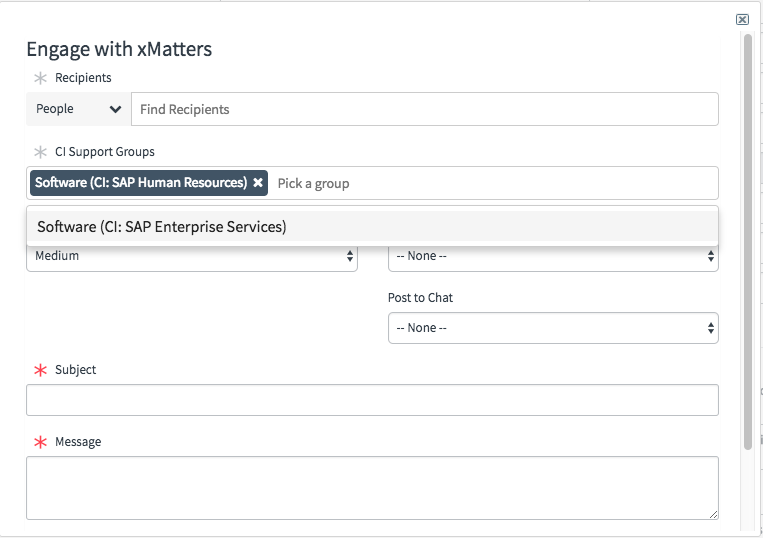
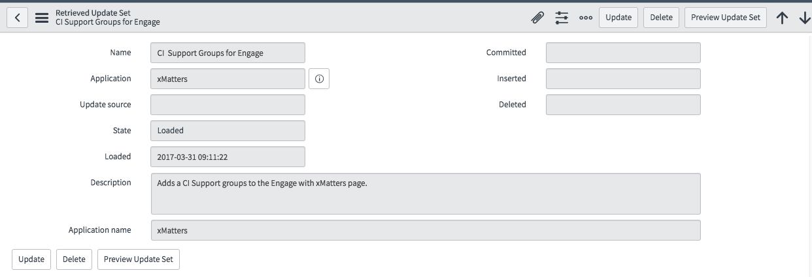

# ServiceNow CI Support groups
Notify support groups of CIs upstream or downstream of outages. This add in adds a new Groups section to the Engage with xMatters form. 

<kbd>
  
</kbd>

---------

<kbd>
  
</kbd>

---------

# Pre-Requisites
* ServiceNow Fuji or Istanbul
* ServiceNow integration to [xMatters v3.7.11+](https://store.servicenow.com/sn_appstore_store.do#!/store/application/5950d7444f2231000e9fa88ca310c78c/3.7.12)
* xMatters account - If you don't have one, [get one](https://www.xmatters.com)!

# Files
* [CISupportGroups.xml](CISupportGroups.xml) - The update set containing the ServiceNow files
* [xMCIUtils.xml](xMCIUtils.xml) - A script include in the Global application scope that builds the CI upstream/downstream list.

# Installation
This add on is packaged as an update set. So login to ServiceNow and navigate to "Retrieved Update Sets" and click the "Import Update Set from XML" link. Select the [CISupportGroups.xml](CISupportGroups.xml) file and click "Upload". This will load the files into ServiceNow, but they need to be "Previewed" for any collisions. 

<kbd>
  
</kbd>

Click the Preview button and the system will query to see if any files will be updated. There will be several scripts that need to be updated so pick the "Accept remote update" to add a new version to the script. Don't worry, the old versions will be saved and can be merged later. Click "Commit" to commit the changes to the database. 

Repeat this process for the [xMCIUtils](xMCIUtils.xml) file. 

## Application ABC set up
No additional set up is needed. When the Engage with xMattes form is displayed, it will retrieve the CI Groups and make them available for selection. 

## xMatters set up
None. The groups selected in the Engage with xMatters form will be added to the recipients array. 
   
# Testing
To test, navigate to an already open Incident and click the Engage with xMatters button. A new field will be seen with selectable tags for each upstream and downstream CI based on the CI in the parent Incident ticket. 

# Troubleshooting
Make sure the parent Incident has a CI populated.
