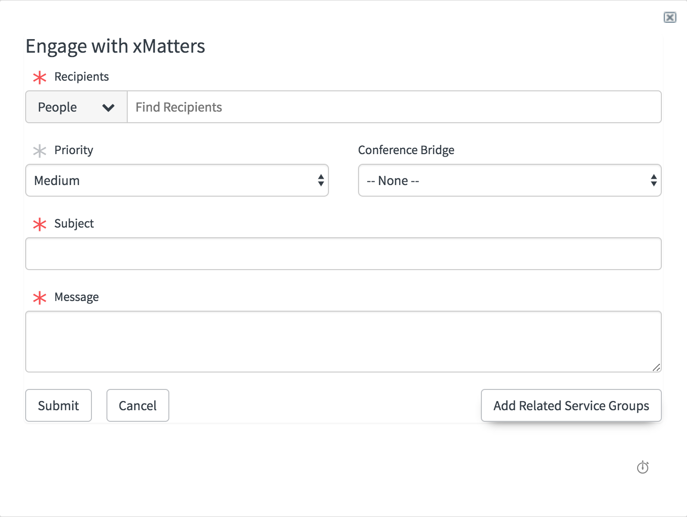

# ServiceNow CI Support groups
Notify support groups of CIs upstream or downstream of outages. This extension creates a button in Engage with xMatters which automatically adds the support groups of the related CIs to the recipient list.

<kbd>
  
</kbd>

---------

<kbd>
  
</kbd>

---------

# Pre-Requisites
* ServiceNow Helsinki, Istanbul, Jakarata or Kingston
* ServiceNow integration to [xMatters v5.0.1+](https://store.servicenow.com/sn_appstore_store.do#!/store/application/5950d7444f2231000e9fa88ca310c78c/)
* xMatters account - If you don't have one, [get one](https://www.xmatters.com)!

# Files
* [CISupportGroups5.0.1.xml](CISupportGroups5.0.1.xml) - The update set containing the ServiceNow files
* [xMCIUtils.xml](xMCIUtils.xml) - A script include in the Global application scope that builds the CI upstream/downstream list.

# Installation
This add on is packaged as an update set. So login to ServiceNow and navigate to "Retrieved Update Sets" and click the "Import Update Set from XML" link. Select the [CISupportGroups5.0.1.xml](CISupportGroups5.0.1.xml) file and click "Upload". This will load the files into ServiceNow, but they need to be "Previewed" for any collisions. 

<kbd>
  
</kbd>

Click the Preview button and the system will query to see if any files will be updated. If required, pick the "Accept remote update" option to add a new version to the script. Don't worry, the old versions will be saved and can be merged later. Click "Commit" to commit the changes to the database. 

Repeat this process for the [xMCIUtils](xMCIUtils.xml) file. 

## xMatters set up
None. The groups selected in the Engage with xMatters form will be added to the recipients list. 
   
# Testing
To test, navigate to an existing Incident in ServiceNow (with an associated CI) and click the Engage with xMatters button. If the Incident CI has related CIs, the Add Related Service Groups button at the bottom right of the dialog will become enabled. Click the button to add the groups to the recipient list. 

# Troubleshooting
Make sure the parent Incident has a CI populated.
